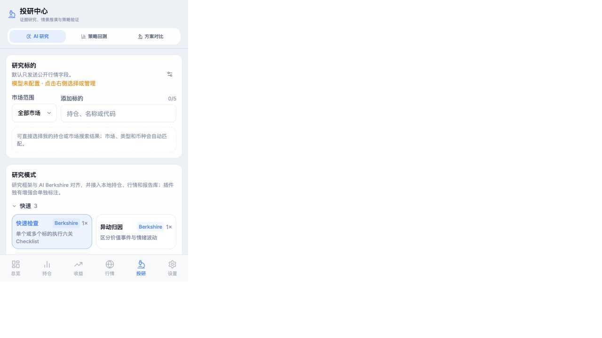

# AI 研究 × 行情数据链路审计

审计日期：2026-07-20

## 结论

现有实现已经形成“标的选择 → 本地行情增强 → 持仓/回测上下文 → 模型研究 → 联网证据 → 报告审计与保存”的基础闭环，但尚未达到可把结果视为稳定、可追溯投研数据产品的程度。单标的、单币种、行情接口正常返回时链路基本可用；多标的、多币种、部分接口失败或复跑旧任务时存在实质性数据偏差风险。

## 当前链路

1. 研究页从持仓或市场搜索选择标的。
2. `enrichResearchContext` 并发请求详情历史行情、公司行动、Yahoo 行情与基本面、Yahoo Quote Summary；美股深度研究额外请求 SEC EDGAR。
3. `buildPublicResearchContext` 将价格序列抽样到最多 60 个点，并加入基本面、公司行动和增强财务数据。
4. 用户授权时附加私人持仓上下文；组合研究附加全部持仓摘要。
5. 研究编排器将上下文送入一个或多个研究 Agent，并按设置选择原生联网、外部搜索或混合联网。
6. 最终报告聚合来源，执行本地数值与结构审计，保存任务和报告。

界面证据：

## 已闭环部分

- 直接复用现有行情模块，而不是另建一套报价实现；A/HK/US/基金/加密等市场能够沿用已有的源降级逻辑。
- 公共上下文会删除本地持仓 ID；数量、成本、权重等私人字段需要用户授权后才发送。
- 单标的会注入当前价、历史价格抽样、公司行动、基础估值数据；深度美股研究可加入 SEC 年度指标。
- 联网模式支持原生、外部和混合策略；外部结果通过模型 API 上下文注入，不直接访问结果网页，并记录查询、来源和错误。
- 任务、报告、来源、联网轨迹和本地审计结果会持久化；运行中断与重启已有测试覆盖。
- 当前完整测试通过：366 项测试、82 个测试套件；TypeScript 类型检查通过。

## 关键问题

### P0：多币种组合研究的权重计算口径错误

`stats.totalAsset` 是将各持仓按 FX 换算后的 CNY 总资产，但 `buildPrivateHoldingContext` 和 `buildPortfolioContext` 使用未换算的原币 `holding.marketValue` 除以 CNY 总资产。美元、港币等持仓的权重会显著偏小，所有权重之和也可能远小于 100%。同时，每个组合持仓摘要没有 `currency` 字段，模型无法判断 `costPrice/currentPrice/marketValue` 的币种；顶层却只给出 `MIXED`。

影响：组合集中度、压力测试、再平衡建议、私人持仓分析会基于错误权重。

建议：持仓摘要同时保存原币金额、原币币种、CNY 基准金额、FX 汇率及汇率时间；权重只使用统一基准金额计算，并增加“权重合计约等于 1”的硬校验。

### P0：多标的研究只增强主标的

多标的模式把所有标的身份放进 `targets`，但只调用一次 `enrichResearchContext(targetToRun, workflowId)`。历史价格、公司行动、基本面、Quote Summary 和 SEC 数据都只属于第一个标的，其余标的最多保留搜索或持仓选择阶段带入的当前价。

影响：模型被要求逐一比较所有公司，但输入数据不对称；排序和筛选可能偏向主标的，且报告表面完整时不容易被发现。

建议：把公共上下文改为 `targetContexts[]`，每个标的独立包含 identity、quote、price history、fundamentals、actions、provenance 和错误状态；并发获取时设置总并发和逐标的状态。

### P0：行情来源、新鲜度和降级状态没有进入研究上下文

行情模块本身存在 `source/fetchedAt/priceDate/isLive/exchange` 等信息，但研究上下文只保留价格和涨跌幅。`dataCutoff` 直接使用浏览器当天日期，不是报价日期、最新历史点日期或财报日期。接口超时或失败时会静默使用原始目标继续，模型和报告审计都不知道本地行情增强失败过。

影响：缓存报价、上一交易日价格或部分失败结果可能被模型表述成“当前行情”；报告重复当天日期即可通过“数据截止时间”检查。

建议：新增结构化 `dataStatus` 和 `provenance[]`，至少包含数据集、服务商、请求时间、实际数据日期、缓存/实时状态、成功/失败、错误原因；报告头部展示最旧关键数据日期，并在行情增强不完整时自动降级审计状态。

### P0：多标的报告的本地数值审计会跨公司混算

多标的时仅关闭了“报告价格 vs 主标的当前价”的比较，但 PE、EPS、市值、股本仍从整篇报告取第一个值组合计算；PE/PB/ROE/市值的多处一致性检查也把不同公司的合法差异当成同一指标冲突。

影响：正确的多公司报告可能被误判失败；也可能把 A 公司的价格与 B 公司的 EPS 组合后生成错误校验结果。

建议：先按标的章节或结构化 JSON 输出切分，再逐标的校验；无法可靠识别归属时应标为“未校验”，不能跨实体计算。

### P1：行情增强是全有或全无，且不可真正中断

五类请求用 `Promise.allSettled` 聚合后再与 20/35 秒超时竞速。只要有一个请求长期未结束，已经成功的数据也会在超时时全部被丢弃；超时不会取消底层请求。研究任务和中断按钮是在增强结束后才进入正式运行状态，用户无法中断这一段等待。

建议：每个数据集独立超时、独立落盘；保留已成功的部分结果；统一接收 AbortSignal；界面显示“行情/基本面/公司行动/SEC”各自状态。

### P1：报告来源审计没有校验“最终正文中的主张—来源”关系

多 Agent 报告把所有中间 Agent 的来源合并后交给最终审计，即使综合报告没有保留这些引用也会增加来源数。未联网时，模型正文里自行生成的两个链接也可以让来源数量通过；`sampled-data` 在没有识别到任何表格数值时仍标记为 pass。

影响：来源面板看起来丰富，但无法证明最终报告关键结论受这些来源支持；“部分通过”状态可能过于乐观。

建议：只对最终正文实际引用的来源计入最终审计；区分结构化 API 引用、外部搜索证据、模型自报链接和本地行情数据；对关键指标建立 claim/source/dataDate 绑定；无抽样数据应为 warning 而非 pass。

### P1：重新开始旧任务不会刷新行情上下文

`resumeJob` 会直接复用原任务的 `publicContext`，跳过行情增强。任务隔天或更久后重启时，仍使用旧价格、旧财务和旧截止日期，但交互文案没有说明是在继续旧快照。

建议：区分“继续未完成任务”和“基于最新数据重新研究”；后者新建 job 并刷新行情，前者保留快照且醒目标注快照时间。

### P1：历史价格口径不足以支持严谨收益分析

研究行情使用普通 close，最多抽样 60 个点，没有传递是否前复权/后复权、采样规则、交易时区和精确日期；A 股 EastMoney 使用复权参数，Yahoo 路径使用普通 close，源切换可能导致口径不同。虽然公司行动单独注入，但没有自动把价格序列调整到统一口径。

建议：研究专用历史数据统一为明确的 adjusted/unadjusted 口径；保留 timestamp、source、timezone、adjustmentMode；涉及收益率时优先复用回测的日线标准化数据而不是图表展示序列。

### P2：外部检索与研究角色、持仓规模的匹配仍偏粗

外部检索对每个标的基本只生成“latest news earnings investor relations”类通用查询；组合研究只为前 4 个持仓生成查询。深度研究的商业、财务、行业、管理层 Agent 共用同一证据包，最多 120,000 字符，并在每个 Agent 与综合阶段重复注入。

影响：长组合覆盖不完整；证据与角色任务不够匹配；多 Agent 模式的上下文和费用膨胀。

建议：按 Agent 生成主题化查询；组合按权重/风险排序分批覆盖全部持仓；证据先去重和结构化，再按角色裁剪；综合阶段引用 Agent 已验证证据索引，不重复注入全部正文。

### P2：币种与标的身份在行情增强后没有完全回写

行情返回的 `currency/name/exchange` 不会更新 `ResearchTarget`，只回写当前价和涨跌幅。手工输入、回测入口或部分搜索源缺币种时，报告可能继续使用空币种或默认币种。

建议：成功报价后用标准化 identity 回写 displaySymbol、name、currency、exchange，并保留用户手工覆盖值与自动识别值的差异。

## 测试缺口

- 没有覆盖多币种组合的权重和金额口径。
- 没有覆盖多标的逐标的行情/基本面增强。
- 没有覆盖行情增强的部分成功、整体超时和用户中断。
- 没有覆盖缓存/实时/失败来源元数据进入报告。
- 没有覆盖多标的报告按公司分段的数值审计。
- 没有端到端断言“最终正文引用的来源”与来源面板、审计数量一致。

## 推荐落地顺序

1. 先修多币种组合权重和每持仓币种字段。
2. 把上下文重构为逐标的 `targetContexts[]`，并加入完整数据状态和来源元数据。
3. 将行情增强从页面组件移到可测试的研究数据服务，支持部分成功、并发限制和中断。
4. 改造报告审计为逐标的、逐指标、逐来源校验。
5. 最后优化角色化检索、证据预算与界面状态展示。

## 验证边界

本次本地界面未配置模型连接，因此只实际走查到研究入口，未发送真实模型请求；模型服务商输出质量、真实联网结果和 API 限流行为未做在线实测。代码链路、测试、类型检查和研究入口界面已检查。
